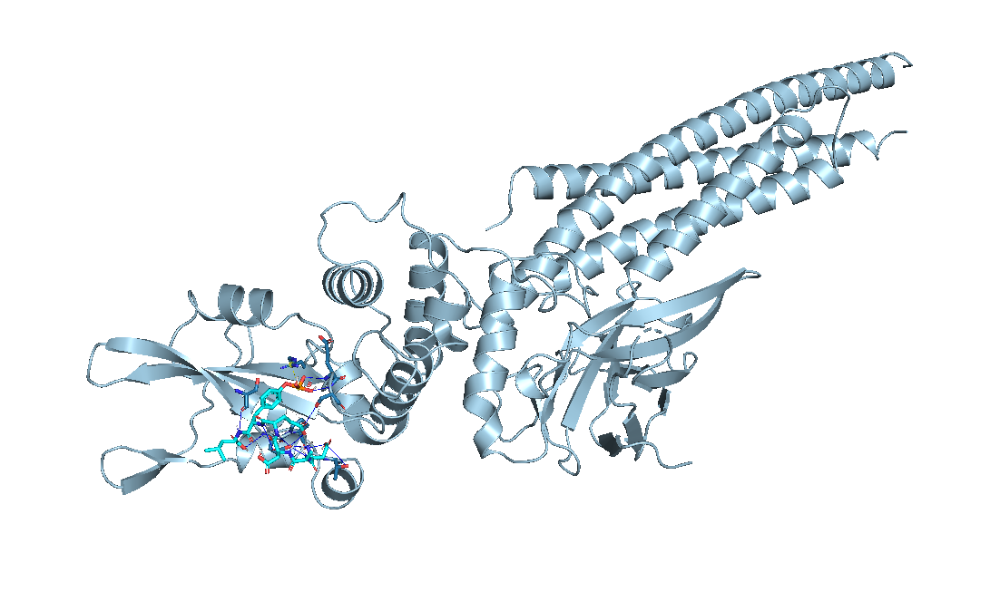

# PLIP
Protein Ligand Interaction Profiler

This repository contains test content and script.

JeongSoo Na. Syntekabio


<br>

원활한 PLIP 세팅, 가동 및 결과 report 정리를 위한 Repository 입니다.  
Window 와 Linux 환경 모두에서 사용 가능합니다.  
Installation 및 Usage를 통해 간단한 test가 가능하지만  
다중 작업 결과물을 통한 csv file 생성의 경우 약간의 python script 수정이 필요합니다.


<br>
<br>

# Installation

### Docker Environment
```sh
# Install Docker in Linux System
sudo wget -qO- http://get.docker.com/ | sh
# 서버 내 도커가 있는 경우 생략
```

```sh
# Install Docker in Window
https://www.docker.com/products/docker-desktop/
# Window에서는 도커 데스크탑을 통해 container 관리 및 이미지 확인, 도커 활성화를 시킬 수 있습니다.
```

### Get PLIP Docker Image
```sh
docker pull pharmai/plip
# Window에서는 Power Shell CMD를 통해 docker 명령어를 실행합니다.
```
- Docker Download 및 PLIP setting에 문제가 있을 경우 Issues 부탁드립니다!


<br>
<br>


# Usage

### Shell Command
```sh
docker run --rm -v ${PWD}:/results -w /r0esults -u $(id -u ${USER}):$(id -g ${USER}) pharmai/plip:latest -f input.pdb -o output_dir_path -x -t -y -p -v
# 해당 명령어를 실행 할 경우
# 저장되어있는 도커 이미지를 통해 input(.pdb file)에서 ouptut을 얻을 수 있습니다.
# 도커 이미지는 해당 명령어가 실행된 뒤 자동으로 종료되며 Docker start, Docker attach로 접근이 불가능합니다.
# -o 옵션에서 지정한 경로 아래
  #  report.txt
  #  report.xml
  #  interaction_image.png
  #  interaction_pymol_file.pse
  #  target.pdb
  #  result_1.pdb
  #  result_2.pdb
  # 등의 output file들이 생성.
  # 이 중 report.txt를 통해 상세 interaction score 확인 가능
```

```sh
# For get interactions in specific peptide chain
docker run --rm -v ${PWD}:/results -w /r0esults -u $(id -u ${USER}):$(id -g ${USER}) pharmai/plip:latest -f input.pdb -o output_dir_path --peptides A -x -t -y -p -v
# --peptides A : A chain peptide와 단백질간의 결합 예측
```

### Parallel Job
- 위의 명령어를 정렬하여 하나하나 실행시키는 것이 아닌 다중 작업을 수행할 수 있다.
- Linux에서는 bash script(.sh), Window에서는 powershell script(.ps1) 혹은 [python script](./run_PLIP.py)를 통해 다중작업 수행
```ps1
# Example file
# [script.ps1] or [script.sh]
docker run --rm -v ${PWD}:/results -w /r0esults -u $(id -u ${USER}):$(id -g ${USER}) pharmai/plip:latest -f input_1.pdb -o output_dir_path/1 -x -t -y -p -v
docker run --rm -v ${PWD}:/results -w /r0esults -u $(id -u ${USER}):$(id -g ${USER}) pharmai/plip:latest -f input_2.pdb -o output_dir_path/2 -x -t -y -p -v
docker run --rm -v ${PWD}:/results -w /r0esults -u $(id -u ${USER}):$(id -g ${USER}) pharmai/plip:latest -f input_3.pdb -o output_dir_path/3 -x -t -y -p -v
```
```sh
bash script.sh
bash script.ps1
# power shell에서 script 실행 권한 에러가 발생할 경우 아래 링크 참조
# https://betterinvesting.tistory.com/276
```

```sh
time parallel --bar -S10.0.86.{1..100} -j 1 --joblog j --res o --resume-failed --files -a script_file
# Linux 서버가 많을 경우 parallel command를 통해 병렬처리를 하여 작업시간을 단축시킬 수 있습니다.
# 엄청난 대량 작업이 아니라면 Window에서도 충분히 단 시간내에 결과 도출 가능
```


<br>
<br>

# Output
- output.pse
  - Interactions : Show Protein-Ligand Interactions to line in pymol
  - Structures : Ligand and Target Protein Binding Locations to stick in pymol




- report.txt
```txt
Prediction of noncovalent interactions for PDB structure Target_PROTEIN
==============================================================================================
Created on 2023/11/10 using PLIP v2.2.2

If you are using PLIP in your work, please cite:
Adasme,M. et al. PLIP 2021: expanding the scope of the protein-ligand interaction profiler to DNA and RNA. Nucl. Acids Res. (05 May 2021), gkab294. doi: 10.1093/nar/gkab294
Analysis was done on model 1.

UNK:Z:0 (UNK) - SMALLMOLECULE
-----------------------------
Interacting chain(s): A


**Hydrophobic Interactions**
+-------+---------+----------+-----------+-------------+--------------+------+--------------+---------------+------------------------+-----------------------+
| RESNR | RESTYPE | RESCHAIN | RESNR_LIG | RESTYPE_LIG | RESCHAIN_LIG | DIST | LIGCARBONIDX | PROTCARBONIDX | LIGCOO                 | PROTCOO               | 
+=======+=========+==========+===========+=============+==============+======+==============+===============+========================+=======================+
| 639   | PRO     | A        | 0         | UNK         | Z            | 3.90 | 23           | 3854          | 10.080, 48.240, -0.776 | 11.952, 47.829, 2.621 | 
+-------+---------+----------+-----------+-------------+--------------+------+--------------+---------------+------------------------+-----------------------+


**Hydrogen Bonds**
+-------+---------+----------+-----------+-------------+--------------+-----------+----------+----------+-----------+-----------+----------+-----------+-------------+--------------+------------------------+------------------------+
| RESNR | RESTYPE | RESCHAIN | RESNR_LIG | RESTYPE_LIG | RESCHAIN_LIG | SIDECHAIN | DIST_H-A | DIST_D-A | DON_ANGLE | PROTISDON | DONORIDX | DONORTYPE | ACCEPTORIDX | ACCEPTORTYPE | LIGCOO                 | PROTCOO                | 
+=======+=========+==========+===========+=============+==============+===========+==========+==========+===========+===========+==========+===========+=============+==============+========================+========================+
| 613   | SER     | A        | 0         | UNK         | Z            | False     | 1.64     | 2.61     | 167.72    | True      | 3652     | Nam       | 31          | O3           | 11.171, 43.877, -0.034 | 11.905, 41.433, 0.514  | 
+-------+---------+----------+-----------+-------------+--------------+-----------+----------+----------+-----------+-----------+----------+-----------+-------------+--------------+------------------------+------------------------+
| 613   | SER     | A        | 0         | UNK         | Z            | True      | 2.00     | 2.66     | 123.43    | True      | 3657     | O3        | 66          | O.co2        | 15.688, 45.568, -0.504 | 13.963, 43.566, -0.189 | 
+-------+---------+----------+-----------+-------------+--------------+-----------+----------+----------+-----------+-----------+----------+-----------+-------------+--------------+------------------------+------------------------+
| 641   | THR     | A        | 0         | UNK         | Z            | True      | 3.42     | 3.99     | 119.74    | True      | 3874     | O3        | 56          | O.co2        | 14.445, 47.370, 6.481  | 16.597, 47.121, 9.836  | 
+-------+---------+----------+-----------+-------------+--------------+-----------+----------+----------+-----------+-----------+----------+-----------+-------------+--------------+------------------------+------------------------+


**Salt Bridges**
+-------+---------+----------+----------------+-----------+-------------+--------------+------+-----------+-----------+-------------------+------------------------+-----------------------+
| RESNR | RESTYPE | RESCHAIN | PROT_IDX_LIST  | RESNR_LIG | RESTYPE_LIG | RESCHAIN_LIG | DIST | PROTISPOS | LIG_GROUP | LIG_IDX_LIST      | LIGCOO                 | PROTCOO               | 
+=======+=========+==========+================+===========+=============+==============+======+===========+===========+===================+========================+=======================+
| 609   | ARG     | A        | 3622,3624,3625 | 0         | UNK         | Z            | 4.84 | True      | Phosphate | 28,28,27,29,30,31 | 10.198, 45.028, -0.884 | 5.445, 45.662, -0.234 | 
+-------+---------+----------+----------------+-----------+-------------+--------------+------+-----------+-----------+-------------------+------------------------+-----------------------+
```
- [python script](./get_PLIP_csv.py)를 통해 생성된 report.txt 내 데이터를 추출하여 csv file 생성

<br>
<br>

# PLIP Options

- '-f' or '-i' is a necessary parameter
```
  -h, --help            show this help message and exit

  -f INPUT [INPUT ...], --file INPUT [INPUT ...]
                        Set input file, '-' reads from stdin

  -i PDBID [PDBID ...], --input PDBID [PDBID ...]

  -o OUTPATH, --out OUTPATH

  -O, --stdout          Write to stdout instead of file

  --rawstring           Use Python raw strings for stdin

  -v, --verbose         Turn on verbose mode

  -q, --quiet           Turn on quiet mode

  -s, --silent          Turn on silent mode

  -p, --pics            Additional pictures

  -x, --xml             Generate report file in XML format

  -t, --txt             Generate report file in TXT (RST) format

  -y, --pymol           Additional PyMOL session files

  --maxthreads MAXTHREADS
                        Set maximum number of main threads (number of binding
                        sites processed simultaneously).If not set, PLIP uses
                        all available CPUs if possible.

  --breakcomposite      Don't combine ligand fragments with covalent bonds but
                        treat them as single ligands for the analysis.

  --altlocation         Also consider alternate locations for atoms (e.g.
                        alternate conformations).

  --nofix               Turns off fixing of PDB files.

  --nofixfile           Turns off writing files for fixed PDB files.

  --nopdbcanmap         Turns off calculation of mapping between canonical and
                        PDB atom order for ligands.

  --dnareceptor         Treat nucleic acids as part of the receptor structure
                        (together with any present protein) instead of as a
                        ligand.
  --name OUTPUTFILENAME
                        Set a filename for the report TXT and XML files. Will
                        only work when processing single structures.

  --peptides PEPTIDES [PEPTIDES ...], --inter PEPTIDES [PEPTIDES ...]
                        Allows to define one or multiple chains as peptide
                        ligands or to detect inter-chain contacts

  --intra INTRA         Allows to define one chain to analyze intra-chain
                        contacts.

  --keepmod             Keep modified residues as ligands

  --nohydro             Do not add polar hydrogens in case your structure
                        already contains hydrogens.

  --model MODEL         Model number to be used for multi-model structures.
```

- 상세한 output report 및 내용을 확인하시려면 [Document](./DOCUMENTATION.md) 참조

<br>
<br>

# Reference
[PLIP](https://github.com/pharmai/plip)